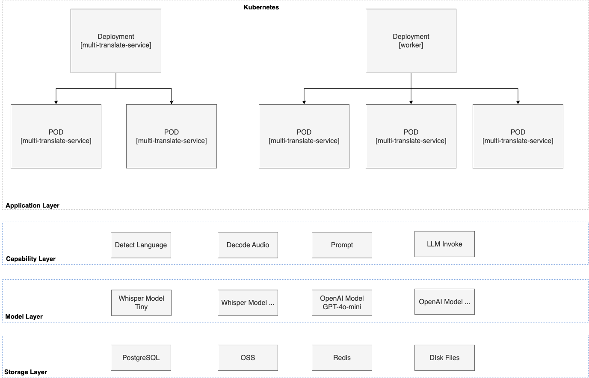
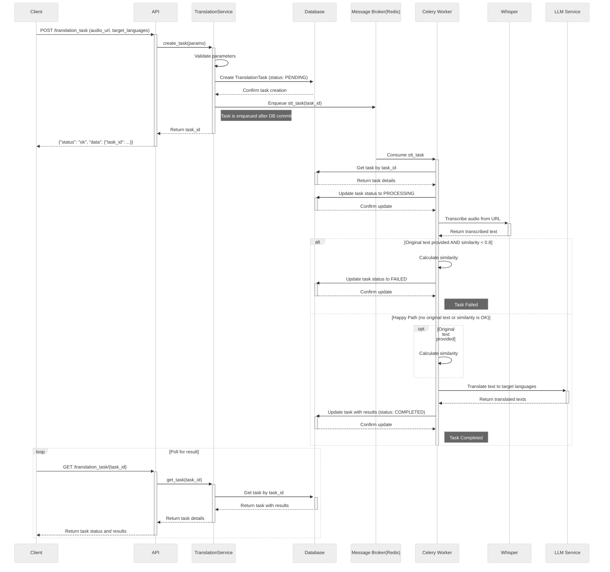
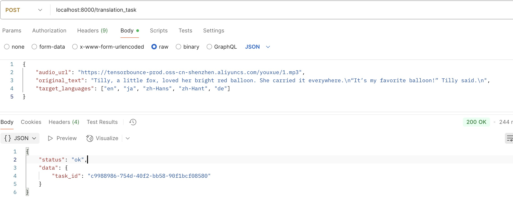
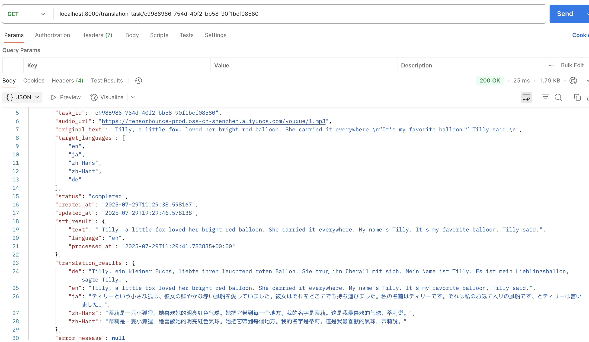
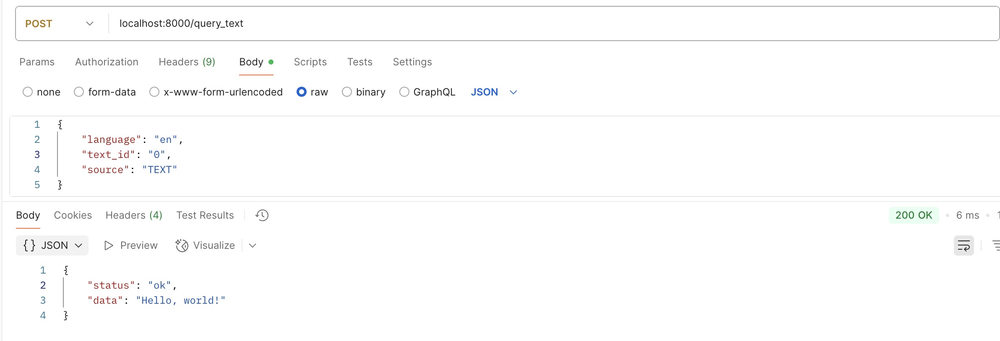

# Enviroment
local enviroment:
> 2020 mac APPLE M1 8G (whisper gpu mode is not supported)

# Quick start
## Install dependency
> uv sync
## Run server
> uv run main.py
## Run worker
> celery -A src.celery_app:celery_app worker --loglevel=info --queues=translation_task_queue

# Structure

``` text
.
├── README.md
├── db
│   └── init.sql        # db init
├── generate_file.py    # generate binary file
├── main.py             # project entry point
├── pyproject.toml
├── resources
│   ├── 1.mp3
│   ├── create_task.jpg
│   ├── get_task.jpg
│   └── query_text.jpg
├── src
│   ├── __init__.py
│   ├── __pycache__
│   ├── app.py          # fastapi app
│   ├── celery_app.py   # celery app 
│   ├── configs         # project global configs package
│   ├── models          # db models package
│   ├── prompts         # llm prompt package
│   ├── routes          # web controller pakcage
│   ├── schemas         # request schemas package
│   ├── services        # services package
│   ├── tasks           # translation task pakcage
│   └── utils           # tool package
├── stories.bin         # multilingual binary pakcage file
├── tests
└── uv.lock
```
# Design

## System Architecture


### Scalability Design
- Horizontal Scaling: multi-translate-service is stateless service, can scale out or scale in on demand.multi celery worker use same broker queue without duplicate task cosumption.
- Auto Scaling: all applications are containerized and orchestrated with kubernetes, supporting auto-scaling based on CPU/Memotry utilizetion metrics.
- Load Balancing: Deploy an ApiGateway in front of the multi-translate-service.
- Microservices Architecture: The key components can be decomposed into microservices to handle massive user traffic.

## Key workflow



## Component
- FastAPI Application: The main entry point for the service. It exposes a RESTful API for clients to interact with. 
- Celery: Manages a distributed task queue for asynchronous processing of translation tasks. This allows the API to remain responsive while computationally expensive operations like STT and translation are performed in the background.
- PostgreSQL Database: Serves as the primary data store. It persists information about translation tasks, including their status, input data, and results.
- Redis: Acts as the message broker for Celery, communication between the FastAPI application and the Celery workers.
- OpenAI Whisper: The speech-to-text engine used to transcribe audio files, localize usage.
- LangChain with OpenAI: The framework and LLM used for multilingual translation.

## Stack
- Backend: Python 3.11+
- Web Framework: FastAPI
- Asynchronous Task Framework: Celery
- Database: PostgreSQL (with asyncpg and psycopg2 drivers)
- Message Queue: Redis
- STT Model: OpenAI Whisper (localize)
- LLM Framework: LangChain
- Translation Model: OpenAI GPT models
- ORM: SQLAlchemy

## Database Schema
| Column                | Type                      | Constraints                  | Description                                      |
| --------------------- | ------------------------- | ---------------------------- | ------------------------------------------------ |
| `id`                  | `UUID`                    | Primary Key, Default `uuid4` | Unique identifier for the record.                |
| `task_id`             | `String(255)`             | Unique, Not Null, Indexed    | Publicly visible unique ID for the task.         |
| `audio_url`           | `Text`                    | Not Null                     | URL of the source audio file.                    |
| `original_text`       | `Text`                    | Nullable                     | Original text for accuracy check.                |
| `target_languages`    | `JSON`                    | Not Null                     | List of target languages for translation.        |
| `status`              | `String(50)`              | Not Null, Default `pending`  | Current status of the task (`TaskStatus` enum).  |
| `created_at`          | `DateTime`                | Not Null, Default `utcnow`   | Timestamp of task creation.                      |
| `updated_at`          | `DateTime`                | Not Null, On Update `utcnow` | Timestamp of the last update.                    |
| `stt_result`          | `JSON`                    | Nullable                     | Stores the result from the STT process.          |
| `translation_results` | `JSON`                    | Nullable                     | Stores the translation results.                  |
| `error_message`       | `Text`                    | Nullable                     | Stores any error message if the task fails.      |

## Similarity Algorithm Design
- Inplementation

``` python
from difflib import SequenceMatcher

def compare_texts(reference, generated):
    matcher = SequenceMatcher(None, reference.lower(), generated.lower())
    similarity = matcher.ratio()
    return similarity
```

- Input: text generated by whisper and original text
- Output: similarity ratio 

- Evaluation
    - The similarity radio is used to quantify STT accuracy.
    - Set threshold(0.8) to detemine acceptable accuracy.

## File Encoding design
``` text
+-----------------------------------------------------+
|         Index Area                                  |
+-----------------------------------------------------+
|         Metadata Header [16]                        |  
+-----------------------------------------------------+
| Language Code | Text ID  | Source | Offset | Length |
|---------------|----------|--------|--------|--------|
|   en          | text_001 | TEXT   |  1000  |  12    |
|   en          | text_002 | AUDIO  |  1012  |  15    |
|   zh          | text_001 | TEXT   |  1027  |  12    |
|   ...         | ...      | ...    |  ...   |  ...   |
+-----------------------------------------------------+
|         Data Area (Variable-Length Records)         |
+-----------------------------------------------------+
| Offset 1000: Hello, world!                          |
| Offset 1012: This is a test.                        |
| Offset 1027: Hello, world!                          |
| ...                                                 |
+-----------------------------------------------------+
```
- Language Code: Fixed length (e.g., 8 bytes, UTF-8 encoded, sufficient to store "en", "zh", "zh-TW", "ja", etc.).
- Text ID: Fixed length (e.g., 16 bytes, storing strings like "text_001").
- Source: Fixed length (e.g., 5 bytes, storing "TEXT" or "AUDIO").
- Offset: 8 bytes (uint64), pointing to the starting position of the text content in the Data Area.
- Length: 4 bytes (uint32), indicating the byte length of the text content.
### Index Area Metadata Header
- Metadata Header (fixed 16 bytes):Total number of index records (4 bytes, uint32)
- Index area length (4 bytes, uint32)
- Data area start offset (8 bytes, uint64)


# Screenshot
## create task


## get task


## query text
